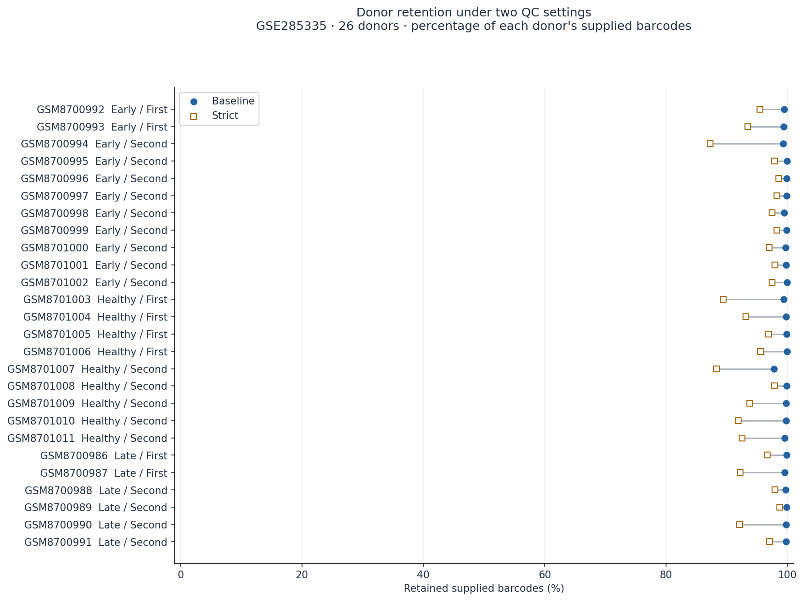
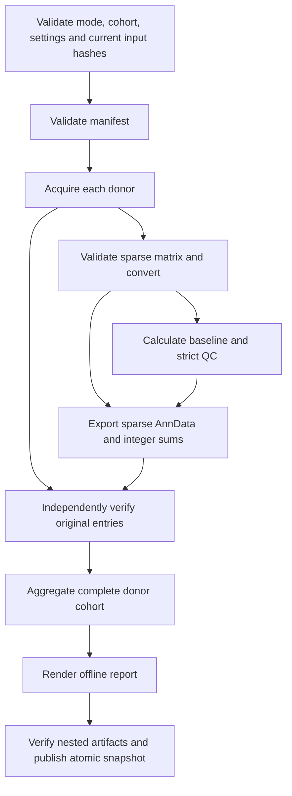

# IgAN-Flow: Reproducible Single-Cell QC for IgA Nephropathy

[](https://github.com/aali4356/igan-flow/actions/workflows/ci.yml)
[](LICENSE)

**A Nextflow workflow for donor-level QC sensitivity analysis of IgA nephropathy PBMC data.** It processes the public GSE285335 expression matrices, preserves original sparse integer counts, and checks how two fixed filters change donor coverage. Version 1.0.0.

The frozen scientific reference contains **26 donors, 282,463 supplied barcodes and 36,601 features**. Baseline QC retains **281,496** barcodes; strict QC retains **268,880**, with all donors represented. The release audit compares every donor's count and cell-mask fingerprint with that reference. See [release evidence and platform status](RELEASE_READINESS.md).



[Downloadable example report](docs/example/report.html) · [Example findings](docs/example/FINDINGS.md) · [Output schema](docs/OUTPUT_SCHEMA.md)

GitHub displays the source of HTML files. Download the example folder and open `report.html` locally to view the complete offline report.

## Quickstart

Prerequisites: Python **3.11**, Bash, curl, tar and internet for initial setup. The complete cohort was validated on native macOS ARM. The synthetic CI suite targets Ubuntu 24.04 x86_64; see [hosted check results](https://github.com/aali4356/igan-flow/actions/workflows/ci.yml) for the status of each commit. Docker, a GPU, credentials and paid compute are unnecessary.

Clone the repository and run the bundled example:

```bash
git clone https://github.com/aali4356/igan-flow.git
cd igan-flow
bash scripts/bootstrap.sh
bash scripts/run.sh test
```

Open `results/test/main/current/report.html`. The bundled fixture runs offline after setup. It has two donors, three genes and three barcodes per donor, with hand-calculated baseline sums `[2,5,1]` and strict sums `[0,3,1]` in source feature order.

Bootstrap installs Java 21 and Nextflow 26.04.6 from checksum-verified release archives and checks installed files and versions. It installs exact Python dependency versions from the committed locks without rewriting them. Set `IGAN_PYTHON` if the Python 3.11 executable has another name. Setup downloads packages; workflow dependency resolution uses Nextflow's offline mode.

Run one real donor, then the full frozen cohort:

```bash
bash scripts/run.sh sample --sample-id GSM8700986
bash scripts/run.sh full
bash scripts/run.sh full --resume
bash scripts/verify.sh
```

The complete expression download is **1,586,505,246 bytes** across 78 gzip files. Cached originals are reused after hash verification. All full-cohort source references are fixed in [assets/reference_inputs.json](assets/reference_inputs.json). Digests were calculated locally and verified from actual files.

Tools, downloads, intermediates and immutable result snapshots live outside the checkout under `~/.cache/igan-nextflow`. Set `IGAN_CACHE` before bootstrap to select another location. Plan for 16 GiB active memory and up to 30 GiB task storage for the full workflow and release checks. The synthetic profile uses two processing workers, a 512 MB heavy-task request and a 2 GB task-executor budget; the JVM is separate. Real processing uses at most four workers and one heavy donor task at a time.

## Workflow and scientific contract



The cohort preserves **9 Healthy, 11 Early and 6 Late** study labels and both 10x 5-prime chemistries. Early/Late remain author labels. Each donor is one biological sampling unit. [Original GEO accession](https://www.ncbi.nlm.nih.gov/geo/query/acc.cgi?acc=GSE285335)

| Setting | Detected features, inclusive | Maximum mitochondrial UMI percentage |
| --- | --- | ---: |
| Baseline | 200–6,000 | 20% |
| Strict | 500–5,000 | 10% |

Both require positive total counts. Strict retained cells must form a subset of baseline. Fewer than 500 retained cells or under 50% retention triggers a donor review flag. Donors with zero retained cells stay in the audit and receive explicit exclusions from analysis-oriented matrices.

The independent verifier reads original sparse coordinate entries, recomputes QC metrics and masks, accumulates every gene/donor/setting sum, and checks AnnData counts, identity, orientation and provenance. Critical verification remains active under `python -O`.

## Results and run state

| Scope | Current report |
| --- | --- |
| Synthetic | `results/test/main/current/report.html` |
| Single donor | `results/sample/GSM8700986/current/report.html` |
| Full cohort | `results/full/main/current/report.html` and convenience link `results/report.html` |

A custom `--run-key experiment1` stays inside its mode. Reserved mode names are rejected. `--sample-id` is valid only in sample mode. Real settings and cohort inputs are fixed for this release; alternate settings are available for local synthetic validation.

Each scope has `latest_attempt.json` and `last_success.json`. `current` switches atomically to a completed snapshot only after source and nested-artifact checks. Running or failed attempts expose a status page; prior successful snapshots remain explicitly historical. Detailed immutable run records, traces, logs, donor exports and validation evidence remain in the task cache.

Resume checks current source bytes and the complete nested output inventory, including AnnData files. Missing or corrupted artifacts fail before a current success is published. Restore a damaged source from its frozen URL and hash. For damaged derived artifacts, run the same command without `--resume` to rebuild and reverify. Keep the corresponding launch and work directories for cache reuse. A snapshot is bound to its recorded implementation and settings; edited code requires a new verified run.

Reports contain embedded figures and relative links to adjacent tables, figures and evidence. `tables/data_locations.tsv` points to large local AnnData exports. Copying only the HTML preserves the visible report; copy the compact folders to preserve its linked tables. Full data and local run logs are ignored by Git.

## Checks and benchmarks

The final full run took **720.8 seconds (12 minutes)** using cached downloads on an Apple M5 Pro with 48 GiB RAM (macOS 26.5.1, ARM). Peak measured donor-process RSS was **1.73 GiB**, with one heavy task at a time. Total task-cache storage after the release runs, preserved baseline and resume was **19.05 GiB**. These measurements exclude initial downloads/setup from workflow wall time; process RSS excludes the JVM and OS.

`verify.sh` runs fresh independent verification of the current full cohort. The unit suite runs through `ci.sh`. Use `bash scripts/verify.sh --quick` for artifact/source consistency without another original-entry computation.

The optional browser suite needs Node 22 or newer. Its pinned Playwright Chromium installation supports macOS and Linux:

```bash
bash scripts/bootstrap_browser.sh
bash scripts/ci.sh
```

On Linux, install browser system libraries if needed:

```bash
source scripts/env.sh
node "$IGAN_CACHE/tools/browser-qa/node_modules/playwright/cli.js" install-deps chromium
```

`ci.sh` runs lint/format checks, unit tests, actual offline synthetic Nextflow execution, corrupt/missing-artifact and stale-status regressions, single-donor and report-source invalidation, relocated paths containing spaces/apostrophes, optimized-Python tampering, and four offline browser cases. It saves current evidence under `results/ci/`. The GitHub workflow runs these same commands with pinned action commits; it does not download the full cohort.

After a completed full run, `bash scripts/check_reproducibility.sh` also proves full-cohort cache reuse. The [release-check procedure](docs/RELEASE_CHECKS.md) joins fresh independent verification with a separate manual figure/layout review. [RELEASE_READINESS.md](RELEASE_READINESS.md) records actual wall time, peak process RSS, storage and task counts. RSS describes individual Python stages and excludes the JVM and OS.

## Interpretation and reuse

Whole-PBMC sums mix cell composition and gene expression. This project measures processing sensitivity. It does not perform annotation, differential expression, clinical prediction, drug ranking, doublet removal or ambient-RNA correction. Upstream barcode filtering remains unknown. Supplied barcodes are not independently established viable cells. Two fixed QC settings do not define universally validated quality thresholds; blood immune cells do not directly measure kidney tissue or future outcomes.

Original code is [MIT licensed](LICENSE). Study data and software dependencies retain separate attribution and terms in [THIRD_PARTY.md](THIRD_PARTY.md). Cite the software using [CITATION.cff](CITATION.cff) and cite the original study separately.
